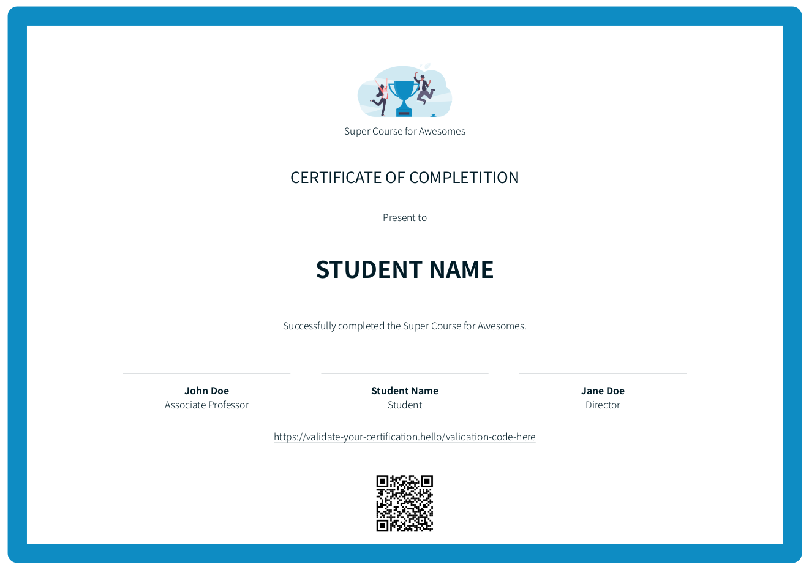

## Certification template for PDFKit in Node.js

I was learning about how to make pdf certifications and created this template to help other developers.




## Getting Started

Install dependencies

```console
yarn
```

or

```console
npm install
```

Start the server

```console
yarn dev
```

ou

```console
npm run dev
```

Open the file output.pdf

Start editing index.js :smiley: